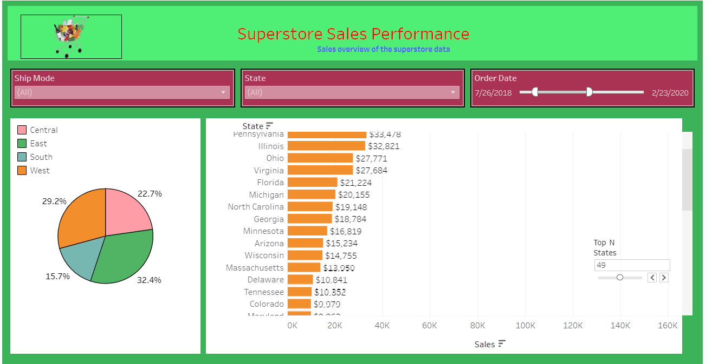

# Superstore Sales Performance Dashboard Project

## Introduction
This project aims to provide a comprehensive overview of the sales performance of the Superstore dataset through interactive visualizations. By leveraging Tableau, we have created a dashboard that offers insights into total sales, profit, volume, sales per customer, regional sales distribution, top-performing states, sub-category sales, and sales trends over time.

## Skills/Concepts Developed
- Data analysis
- Data visualization
- Dashboard creation using Tableau
- Parameterization and filtering
- Interactive dashboard design

## Problem Statement
The Superstore company wants to gain insights into its sales performance to identify areas for improvement and optimization. Specifically, they seek to understand total sales, profit, volume, regional distribution, customer purchasing behavior, top-performing states, and trends over time.

## Modeling
In this project, we utilized Tableau's features such as filtering, aggregation, parameterization, and interactivity to model the Superstore dataset and create meaningful visualizations that address the business requirements.

## Visualization
The visualization techniques employed in this project include:
- Scorecards for total sales, profit, volume, and sales per customer
- Pie chart displaying regional sales distribution
- Bar chart showcasing top N states by sales
- Bubble chart representing sales by sub-category
- Line chart illustrating sales trends over time

## Conclusion
Through the analysis and visualization of the Superstore dataset, several key insights were uncovered:
- Region-wise sales distribution highlights areas of strength and weakness.
- Top-performing states provide opportunities for targeted marketing and sales strategies.
- Sub-category sales analysis identifies product categories with high and low performance.
- Sales trends over time reveal seasonal patterns and long-term growth trends.

## Recommendations
Based on the insights derived from the dashboard, the following recommendations are proposed:
- Focus marketing efforts on regions with low sales to increase market penetration.
- Implement targeted promotions and discounts in top-performing states to drive sales further.
- Explore opportunities for product diversification or optimization within underperforming sub-categories.
- Monitor and adapt sales strategies in response to identified trends and patterns.

## How to Use
To explore the Superstore Sales Performance Dashboard:
1. Open the Tableau workbook.
2. Interact with the filters to adjust the date range, segment, and ship mode.
3. Explore each visualization to gain insights into different aspects of sales performance.
4. Use the actionable filters in the Pie chart and Bubble chart to drill down into specific regions or sub-categories.
5. Refer to the dashboard description for guidance on interpreting each visualization.

## Credits
- The Superstore dataset is provided by Tableau and can be accessed through the Tableau repository.
- Inspiration for dashboard design and visualization techniques comes from various Tableau resources and community contributions.

## About the Author
This project was created by [P.Prakash]. For more information or inquiries, please contact [prakash2822002@gmail.com].
